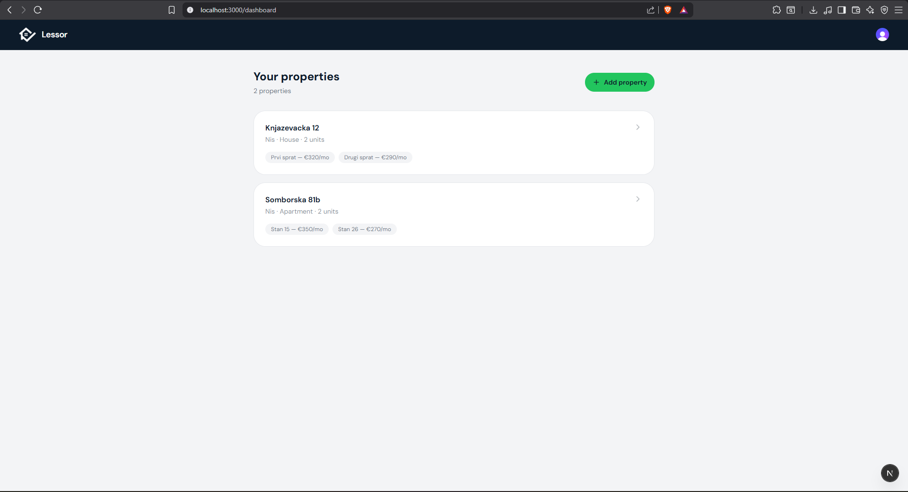
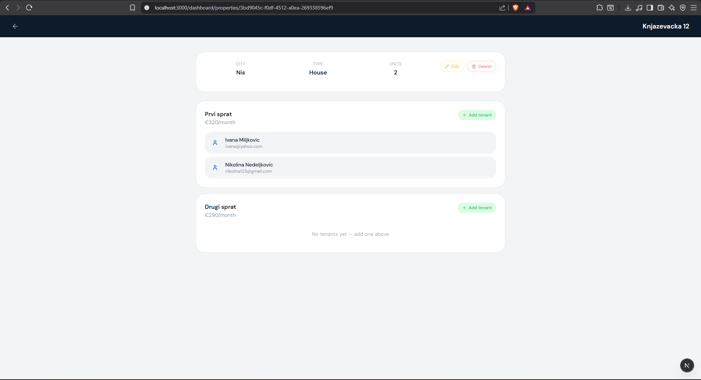
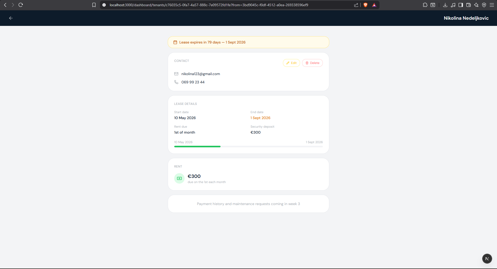

# Lessor — Property Management for Small Landlords

> A full-stack SaaS application built for landlords with 1–10 rental units. Track rent payments, manage tenants, handle maintenance requests, and store documents — all in one place.

🌐 **Live app:** [lessor.vercel.app](https://lessor.vercel.app)

---

## Overview

Lessor is a solo-built SaaS product targeting a real market gap — small landlords who are too small for enterprise property management software but too large to keep managing rentals in spreadsheets and WhatsApp messages.

The project covers the full product development lifecycle: idea validation, market research, product design, full-stack development, CI/CD pipeline, cloud deployment, and pre-launch marketing.

---

<h2>Screenshots</h2>

<p align="center">
  
  
  
</p>

---

## Tech Stack

### Frontend
- **Next.js 14** (App Router, TypeScript)
- **Tailwind CSS** — utility-first styling
- **shadcn/ui** — accessible component library
- **Clerk** — authentication (JWT-based, social login, email/password)
- **Lucide React** — icon library

### Backend
- **ASP.NET Core Web API** (.NET 8, C#)
- **Entity Framework Core** — ORM with code-first migrations
- **Npgsql** — PostgreSQL driver for .NET
- **Hangfire** — background job scheduling (overdue rent detection, expiry reminders)

### Database & Storage
- **PostgreSQL** (hosted on Supabase)
- **Supabase Storage** — document and file storage

### Infrastructure & DevOps
- **Vercel** — frontend hosting with automatic preview deployments
- **Railway** — backend hosting with Dockerised .NET deployment
- **GitHub Actions** — CI/CD pipeline (build + test on every push to main)
- **Docker** — containerised backend deployment
- **Sentry** — error tracking

### Payments
- **Paddle** — subscription billing (merchant of record, handles VAT)

---

## Architecture

```
┌─────────────────────┐         HTTPS + JWT          ┌─────────────────────┐
│   Next.js Frontend  │  ─────────────────────────►  │  .NET Web API       │
│   (Vercel)          │                               │  (Railway)          │
└─────────────────────┘                               └─────────────────────┘
         │                                                      │
         │ Clerk Auth                                  EF Core  │
         ▼                                                      ▼
┌─────────────────────┐                               ┌─────────────────────┐
│   Clerk (JWT)       │                               │  PostgreSQL         │
│                     │                               │  (Supabase)         │
└─────────────────────┘                               └─────────────────────┘
```

---

## Project Structure

```
lessor/
├── frontend/                  # Next.js application
│   ├── app/
│   │   ├── dashboard/         # Protected app pages
│   │   ├── sign-in/           # Clerk auth pages
│   │   ├── sign-up/
│   │   └── page.tsx           # Landing page
│   ├── components/            # Reusable UI components
│   └── lib/                   # API client, utilities
│
├── backend/
│   └── LandlordApi/
│       ├── Controllers/       # REST API endpoints
│       ├── Services/          # Business logic layer
│       ├── Models/            # EF Core entity models
│       ├── Data/              # DbContext, migrations
│       ├── Jobs/              # Hangfire background jobs
│       └── Dockerfile
│
└── .github/
    └── workflows/
        ├── frontend.yml       # Next.js CI pipeline
        └── backend.yml        # .NET CI pipeline
```

---

## Database Schema

```
RentalProperties  ──┐
                    ├── Units ──── Tenants ──── RentRecords
                    ├── Documents
                    └── MaintenanceRequests
```

| Table | Description |
|---|---|
| `RentalProperties` | Properties owned by a landlord |
| `Units` | Individual rentable units within a property |
| `Tenants` | Tenant records with lease details |
| `RentRecords` | Monthly rent tracking — auto-generated from lease data |
| `MaintenanceRequests` | Maintenance issues with status tracking |
| `Documents` | Uploaded files with expiry tracking |

---

## Key Features

- **Rent tracking** — automatic monthly rent records generated from lease data, manual payment logging, overdue detection and alerts
- **Tenant management** — full lease lifecycle, payment history, notes log, contact management
- **Maintenance requests** — timestamped issue tracking with status workflow (open → in progress → resolved)
- **Document storage** — categorised file storage with automatic expiry reminders for leases and certificates
- **JWT authentication** — Clerk-issued tokens verified by the .NET backend on every request
- **Background jobs** — Hangfire runs daily checks for overdue rent and upcoming lease/document expiries
- **Multi-property dashboard** — at-a-glance status across all properties and units

---

## CI/CD Pipeline

Every push to `main` triggers GitHub Actions:

```
Push to main
    │
    ├── frontend.yml
    │   ├── npm install
    │   ├── npm run build
    │   └── Vercel auto-deploys ✓
    │
    └── backend.yml
        ├── dotnet restore
        ├── dotnet build
        ├── dotnet test
        └── Railway auto-deploys via Docker ✓
```

Path filters ensure the frontend pipeline only runs on frontend changes and vice versa.

---

## Running Locally

### Prerequisites
- Node.js 20+
- .NET 8 SDK
- PostgreSQL (or a Supabase account)
- Clerk account

### Frontend

```bash
cd frontend
cp .env.example .env.local
# Fill in your Clerk and API keys in .env.local
npm install
npm run dev
```

### Backend

```bash
cd backend/LandlordApi
# Fill in your connection string in appsettings.Development.json
dotnet restore
dotnet ef database update
dotnet run
```

Frontend runs on `http://localhost:3000`, backend on `http://localhost:5000`.

---

## Product & Business Context

Lessor is being built as a real product, not just a portfolio project:

- **Market research** — validated demand through Reddit landlord communities (`r/landlord`, `r/PropertyManagement`)
- **Pre-launch waitlist** — live at [lessor.vercel.app](https://lessor.vercel.app) with early access offer
- **Monetisation** — single subscription tier at €12/month via Paddle, first 50 users get 3 months free
- **Solo-built** — designed, developed, and deployed by one developer from idea to launch

---

## What I Learned Building This

- Architecting a full-stack monorepo with separate frontend and backend deployment pipelines
- Integrating third-party auth (Clerk) across a Next.js frontend and a separate .NET API using JWT verification
- Designing a relational schema in PostgreSQL and managing it with EF Core code-first migrations
- Containerising a .NET API with Docker for Railway deployment
- Building a CI/CD pipeline with GitHub Actions including path filters for monorepo efficiency
- Pre-launch product marketing — landing page, waitlist, community outreach

---

## Status

🚧 **Currently in development — Week 2 of 4 to MVP launch**

- ✅ Week 1 — Infrastructure, auth, CI/CD, walking skeleton deployed
- ✅ Week 2 — Properties and tenants CRUD (in progress)
- 🔄 Week 3 — Rent tracking, overdue detection, email alerts
- ⬜ Week 4 — Document storage, Paddle billing, launch

---

## Contact

Built by Nikola Milijevic — nikolamilijevic5@gmail.com / www.linkedin.com/in/nikola-milijevic
